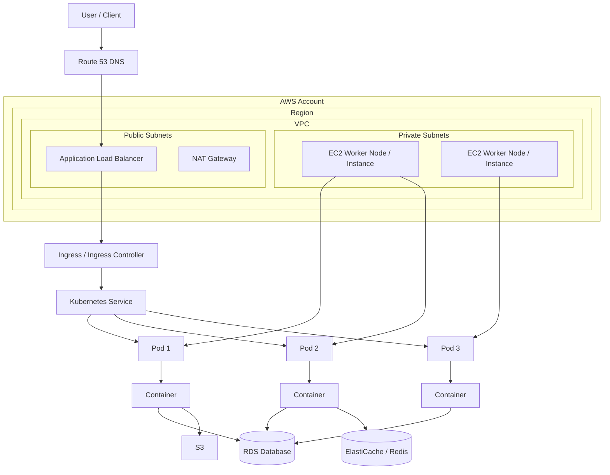

# AWS Deployment Architecture Relationships — خريطة العلاقات بين المكونات

> الهدف: الملف ده يشرح علاقة مكونات AWS/Kubernetes ببعض لما تعمل Deploy لتطبيق، خصوصًا العلاقة بين Instance و Pod وباقي المكونات.

---

## 1) الصورة الكبيرة

لو بتعمل Deploy لتطبيق Web/API على AWS باستخدام Kubernetes غالبًا هتستخدم الشكل ده:

```text
User / Client
   |
   v
Route 53 (DNS)
   |
   v
CloudFront / ALB / NLB
   |
   v
Ingress Controller / Service
   |
   v
Pod(s)
   |
   v
Application Container(s)
   |
   v
Database / Cache / Queue / Storage
```

ولو Kubernetes شغال على AWS EKS:

```text
AWS Account
 └── Region
     └── VPC
         ├── Public Subnets
         │   ├── Load Balancer
         │   └── NAT Gateway
         └── Private Subnets
             ├── EKS Worker Nodes = EC2 Instances
             │   └── Pods
             ├── RDS / ElastiCache
             └── Internal Services
```

---

## 2) العلاقات الأساسية بين AWS و Kubernetes

### AWS Account
- هو الحساب اللي جواه كل الموارد.
- يحتوي على Regions، IAM، Billing، VPCs، EKS، EC2، RDS، S3... إلخ.

### Region
- منطقة جغرافية مثل `eu-central-1` أو `me-south-1`.
- جوه كل Region يوجد Availability Zones.

### Availability Zone — AZ
- داتا سنتر أو مجموعة داتا سنتر داخل Region.
- بنوزع الموارد عليها عشان High Availability.

### VPC
- شبكة خاصة داخل AWS.
- كل الموارد الشبكية المهمة بتتحط جواها: EC2, EKS Nodes, RDS, Load Balancers.

### Subnet
- جزء من VPC داخل Availability Zone واحدة.
- نوعين غالبًا:
  - Public Subnet: موارد ينفع توصل للإنترنت مباشرة أو عليها Load Balancer/NAT.
  - Private Subnet: موارد داخلية زي Nodes و Databases.

### Internet Gateway — IGW
- يسمح للـ Public Subnets تتواصل مع الإنترنت.

### NAT Gateway
- يسمح للموارد في Private Subnets تطلع للإنترنت بدون ما الإنترنت يدخل عليها مباشرة.
- مثال: Worker Node في Private Subnet يحتاج يسحب Docker Image من ECR.

### Route Table
- تحدد الترافيك يروح فين.
- Public subnet route عادة:

```text
0.0.0.0/0 -> Internet Gateway
```

- Private subnet route عادة:

```text
0.0.0.0/0 -> NAT Gateway
```

---

## 3) مكونات Kubernetes داخل AWS EKS

### EKS Cluster
- Kubernetes Control Plane مُدار من AWS.
- مسؤول عن إدارة الحالة المطلوبة Desired State.
- لا يشغل تطبيقاتك مباشرة، لكنه يدير تشغيلها على Worker Nodes.

### Control Plane
- فيه مكونات Kubernetes الأساسية مثل API Server و Scheduler و Controller Manager.
- في EKS أنت لا تديرها بنفسك؛ AWS تديرها.

### Worker Node
- سيرفر بيشغل التطبيقات.
- في AWS غالبًا يكون EC2 Instance أو Fargate.

### EC2 Instance
- Virtual Machine على AWS.
- لما تكون جزء من EKS، بتشتغل كـ Kubernetes Node.
- عليها kubelet و container runtime.
- الـ Pods بتتوزع عليها.

### Node Group
- مجموعة Worker Nodes.
- ممكن تكون Managed Node Group من AWS.
- بتسهل إنشاء وتحديث وتوسيع EC2 Instances الخاصة بالـ Cluster.

### Pod
- أصغر وحدة تشغيل في Kubernetes.
- يحتوي على Container واحد أو أكثر.
- الـ Pod لا يعيش وحده غالبًا، بل يتم إنشاؤه بواسطة Deployment أو StatefulSet أو Job.

### Container
- نسخة تشغيل من Docker Image.
- التطبيق نفسه غالبًا يكون Container داخل Pod.

### Deployment
- Resource في Kubernetes مسؤول عن تشغيل عدد معين من Pods.
- لو Pod وقع، Deployment ينشئ بديل.
- يستخدم ReplicaSet داخليًا.

### ReplicaSet
- يضمن وجود عدد محدد من الـ Pods.
- غالبًا لا تتعامل معه مباشرة، Deployment يديره.

### Service
- عنوان ثابت للوصول للـ Pods.
- لأن الـ Pods IPs متغيرة، Service يعطيك Endpoint ثابت.
- أنواعه:
  - ClusterIP: داخلي داخل الكلاستر.
  - NodePort: يفتح Port على كل Node.
  - LoadBalancer: ينشئ AWS Load Balancer غالبًا.

### Ingress
- قواعد HTTP/HTTPS للوصول للتطبيقات.
- يحتاج Ingress Controller مثل AWS Load Balancer Controller أو NGINX Ingress.

### Ingress Controller
- ينفذ قواعد Ingress.
- على AWS ممكن ينشئ Application Load Balancer تلقائيًا.

### ConfigMap
- يخزن Configuration غير حساسة.
- مثال: `APP_ENV=production`.

### Secret
- يخزن بيانات حساسة مثل Passwords و Tokens.
- الأفضل ربطه مع AWS Secrets Manager أو Parameter Store.

### Namespace
- تقسيم منطقي داخل Cluster.
- مثال: `dev`, `staging`, `production`.

### Horizontal Pod Autoscaler — HPA
- يكبر أو يصغر عدد Pods بناءً على CPU/Memory أو Metrics.

### Cluster Autoscaler / Karpenter
- يكبر أو يصغر عدد Worker Nodes بناءً على احتياج الـ Pods.
- لو Pods مش لاقية مكان تشتغل، يضيف Nodes.

---

## 4) العلاقة بين Instance و Node و Pod

```text
EC2 Instance = Kubernetes Worker Node
Worker Node يحتوي على Pods
Pod يحتوي على Container(s)
Container يشغل التطبيق
```

مثال:

```text
EC2 Instance: ip-10-0-1-25
 ├── Pod: backend-api-abc123
 │   └── Container: backend-api
 ├── Pod: backend-api-def456
 │   └── Container: backend-api
 └── Pod: nginx-ingress-controller
     └── Container: controller
```

يعني:

- Instance هو السيرفر.
- Node هو نفس السيرفر من وجهة نظر Kubernetes.
- Pod هو الوحدة اللي التطبيق بيشتغل جواها.
- Container هو التطبيق/البروسيس نفسه.

---

## 5) مسار الترافيك عند Deploy Web App

### External Traffic

```text
User
 -> Route 53
 -> Application Load Balancer
 -> Ingress Controller / Ingress Rules
 -> Kubernetes Service
 -> Pod
 -> Container
```

### Internal Traffic

```text
Pod A
 -> Service B
 -> Pod B
```

### Database Traffic

```text
Pod/Application
 -> RDS Endpoint
 -> Database
```

يفضل قاعدة البيانات تكون في Private Subnet، ولا يتم فتحها للعالم الخارجي.

---

## 6) مثال عملي لعلاقات تطبيق Backend على EKS

```text
Route 53
 └── api.example.com
     └── ALB
         └── Ingress
             └── Service: backend-service
                 ├── Pod: backend-1
                 ├── Pod: backend-2
                 └── Pod: backend-3
                     └── Container Image: ECR/backend:v1.0.0
```

الموارد الداعمة:

```text
ECR          -> يخزن Docker Images
RDS          -> قاعدة بيانات
Secrets      -> بيانات اتصال قاعدة البيانات
ConfigMap    -> إعدادات التطبيق
CloudWatch   -> Logs و Metrics
IAM Role     -> صلاحيات التطبيق أو النودز
SecurityGroup-> Firewall على مستوى AWS
```

---

## 7) CI/CD Deployment Flow

```text
Developer pushes code
   |
   v
GitHub Actions / GitLab CI / Azure DevOps / AWS CodePipeline
   |
   v
Build Docker Image
   |
   v
Push Image to Amazon ECR
   |
   v
Update Kubernetes Deployment Image Tag
   |
   v
kubectl apply / helm upgrade / ArgoCD sync
   |
   v
EKS creates new Pods
   |
   v
Service routes traffic to healthy Pods
```

---

## 8) ملفات Kubernetes الأساسية لأي Deploy

عادة تحتاج:

```text
namespace.yaml
configmap.yaml
secret.yaml
deployment.yaml
service.yaml
ingress.yaml
hpa.yaml
```

ولو باستخدام Helm:

```text
Chart.yaml
values.yaml
templates/deployment.yaml   س
templates/service.yaml
templates/ingress.yaml
templates/hpa.yaml
```

---

## 9) مثال Kubernetes مبسط

### Deployment

```yaml
apiVersion: apps/v1
kind: Deployment
metadata:
  name: backend
  namespace: production
spec:
  replicas: 3
  selector:
    matchLabels:
      app: backend
  template:
    metadata:
      labels:
        app: backend
    spec:
      containers:
        - name: backend
          image: 123456789012.dkr.ecr.eu-central-1.amazonaws.com/backend:v1.0.0
          ports:
            - containerPort: 3000
          envFrom:
            - configMapRef:
                name: backend-config
            - secretRef:
                name: backend-secret
```

### Service

```yaml
apiVersion: v1
kind: Service
metadata:
  name: backend-service
  namespace: production
spec:
  type: ClusterIP
  selector:
    app: backend
  ports:
    - port: 80
      targetPort: 3000
```

### Ingress

```yaml
apiVersion: networking.k8s.io/v1
kind: Ingress
metadata:
  name: backend-ingress
  namespace: production
  annotations:
    kubernetes.io/ingress.class: alb
spec:
  rules:
    - host: api.example.com
      http:
        paths:
          - path: /
            pathType: Prefix
            backend:
              service:
                name: backend-service
                port:
                  number: 80
```

---

## 10) IAM والعلاقات الأمنية

### IAM User / Role
- يحدد مين يقدر يعمل إيه داخل AWS.

### Node IAM Role
- Role مرتبط بالـ EC2 Worker Nodes.
- يسمح للنودز تسحب Images من ECR وتكتب Logs مثلًا.

### IRSA — IAM Roles for Service Accounts
- طريقة لإعطاء Pod صلاحيات AWS محددة بدون إعطاء كل Node نفس الصلاحيات.
- مثال: Pod يحتاج يقرأ من S3 فقط.

العلاقة:

```text
Kubernetes ServiceAccount
 -> مرتبط بـ IAM Role
 -> Pod يستخدم ServiceAccount
 -> Pod يحصل على صلاحيات AWS محددة
```

---

## 11) Security Groups و Network Policies

### Security Group
- Firewall على مستوى AWS.
- يتحكم في الدخول والخروج للـ EC2, Load Balancer, RDS.

### Network Policy
- Firewall داخل Kubernetes بين Pods.
- يتحكم مين Pod يقدر يكلم مين.

مثال:

```text
ALB Security Group يسمح بـ 443 من الإنترنت
Node Security Group يسمح بترافيك من ALB
RDS Security Group يسمح بـ 5432 من Node/Pod CIDR فقط
```

---

## 12) Storage

### EBS
- Disk يتوصل بـ Node/Pod.
- مناسب لحالات تحتاج Block Storage.

### EFS
- Shared File System.
- ممكن أكتر من Pod يستخدموه في نفس الوقت.

### S3
- Object Storage.
- مناسب للملفات، الصور، backups، static assets.

### PersistentVolume و PersistentVolumeClaim

```text
Pod
 -> PVC
 -> PV
 -> EBS/EFS
```

---

## 13) Observability

### CloudWatch
- Logs و Metrics على AWS.

### Container Insights
- مراقبة Nodes و Pods و Containers.

### Prometheus / Grafana
- Metrics و Dashboards متقدمة.

### Fluent Bit / CloudWatch Agent
- إرسال Logs من Pods و Nodes إلى CloudWatch أو OpenSearch.

---

## 14) تبسيط سينيور

تخيل AWS زي عمارة كبيرة:

- Account = الشركة المالكة للعمارة.
- Region = مدينة.
- AZ = فرع أو مبنى داخل المدينة.
- VPC = سور ومخطط الشبكة بتاعك.
- Subnet = أدوار أو مناطق جوه العمارة.
- EC2 Instance = شقة/سيرفر.
- Kubernetes Node = نفس الشقة لكن Kubernetes شايفها كعامل تشغيل.
- Pod = غرفة جوه الشقة.
- Container = الشخص/التطبيق اللي شغال جوه الغرفة.
- Service = رقم داخلي ثابت يوصل للغرف حتى لو اتغيرت.
- Ingress/ALB = بوابة العمارة.
- Route 53 = دفتر العناوين/DNS.
- RDS = خزنة البيانات.
- ECR = مخزن صور التطبيقات.
- CI/CD = خط إنتاج يبني التطبيق ويوصله للكلاستر.

---

## 15) Mermaid Diagram



---

## 16) Checklist قبل Production Deploy

- [ ] VPC مقسمة Public/Private Subnets على أكثر من AZ.
- [ ] Worker Nodes في Private Subnets.
- [ ] Load Balancer في Public Subnets.
- [ ] RDS في Private Subnets.
- [ ] Security Groups مقفولة بأقل صلاحيات.
- [ ] Images محفوظة في ECR.
- [ ] Secrets لا توضع داخل الكود.
- [ ] Readiness/Liveness Probes مضافة للـ Deployment.
- [ ] Requests/Limits محددة للـ Containers.
- [ ] HPA مفعّل لو التطبيق يحتاج Scaling.
- [ ] Logs و Metrics مفعلة.
- [ ] CI/CD بيعمل Build ثم Push ثم Deploy.
- [ ] TLS/HTTPS مفعّل على Ingress/ALB.
- [ ] Backups مفعلة لقاعدة البيانات.

---

## 17) الخلاصة السريعة

العلاقة الأهم:

```text
AWS EC2 Instance = Kubernetes Node
Node يشغل Pods
Pod يشغل Containers
Deployment يدير Pods
Service يثبت الوصول للـ Pods
Ingress/Load Balancer يفتح الوصول من خارج الكلاستر
VPC/Subnets/Security Groups تحكم الشبكة والأمان
ECR يخزن Images
RDS/S3/Redis هي خدمات يعتمد عليها التطبيق
CI/CD ينقل الكود من Repo إلى Production
```
